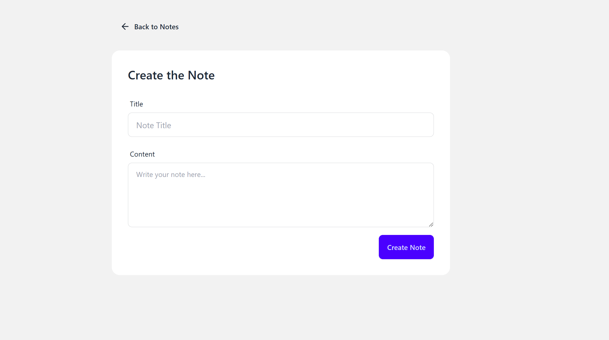
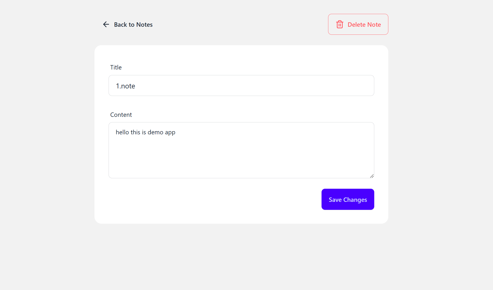
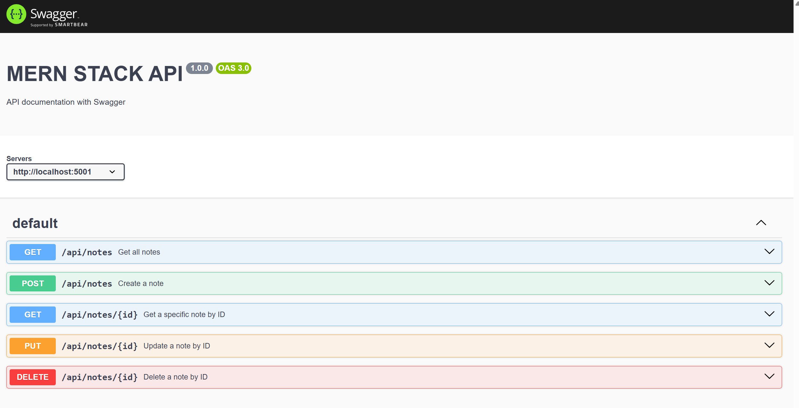

# Not Tutma Uygulaması 📝

Bu proje, temel bir **Not Tutma Uygulaması**dır ve **frontend + backend** deneyimimi geliştirmek için tasarlanmıştır.  

---

## Teknolojiler

**Frontend:**  
- React, React Router  
- Axios ile API entegrasyonu  
- TailwindCSS & DaisyUI ile modern ve responsive tasarım  
- React Hot Toast ile kullanıcı bildirimleri  

**Backend:**  
- Node.js + Express  
- MongoDB ile veri yönetimi  
- CORS & dotenv ile yapılandırma  
- Swagger ile API dokümantasyonu  

---

## Kurulum

### Backend
```bash
cd backend
npm install
npm run dev

### Frontend
```bash
cd frontend
npm install
npm run dev

## Proje Görselleri

  
  
  
 
